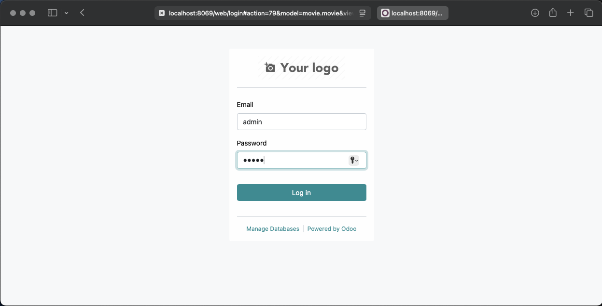
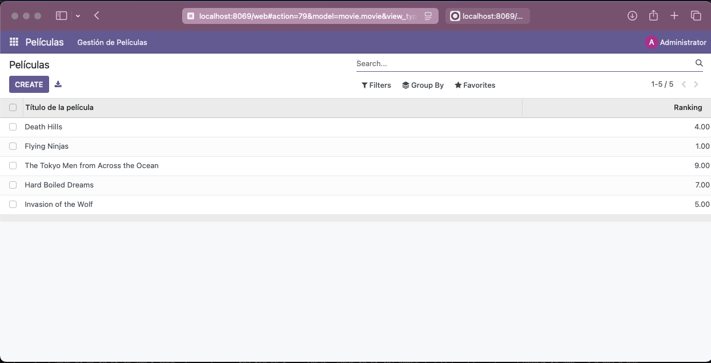
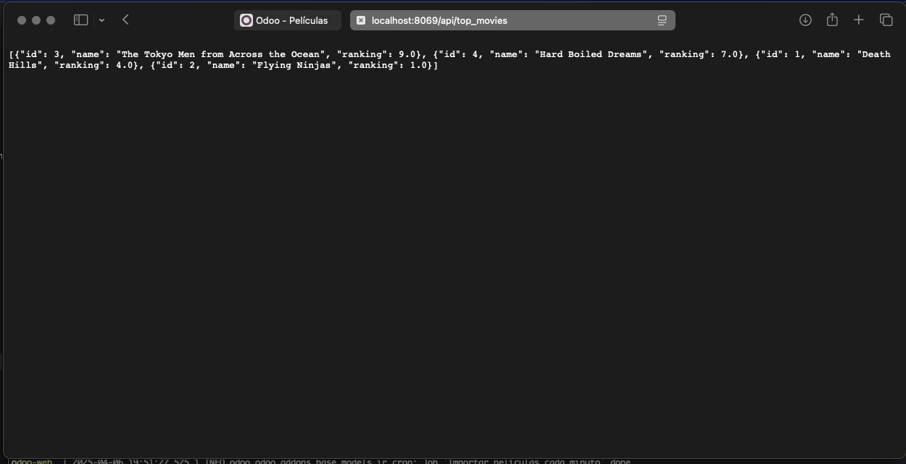
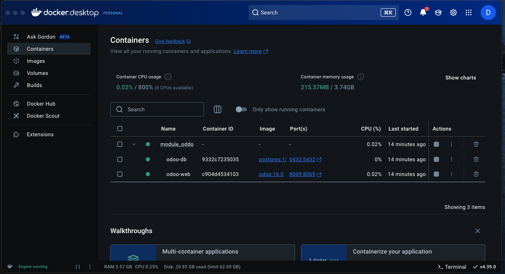
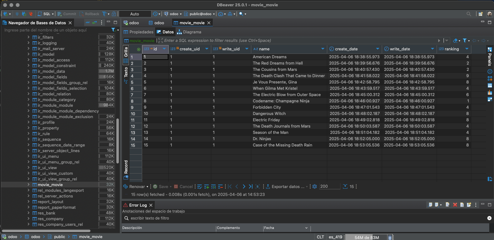

# Módulo de Gestión de Películas en Odoo 16 🎮

Este repositorio contiene un módulo personalizado para **Odoo 16**, diseñado para la gestión automática de películas a través de una API REST externa. Utiliza `cron jobs` para importar datos y expone un endpoint REST para consultar el top 10 de películas mejor calificadas.

---

## 📦 Descripción General del Módulo

El módulo `movie_manager` permite:
- Definir un modelo de películas con Título y ranking.
- Ejecutar tareas programadas (cron) que consultan una API REST para registrar películas.
- Consultar las películas mejor clasificadas mediante un endpoint REST (`/api/top_movies`).

---

## ⚙️ Requisitos

- Docker
- Docker Compose
- Acceso a Internet

---

## 🚀 Instalación y Configuración

1. Clona el repositorio:
```bash
git clone https://github.com/dionnys/module_oddo.git
cd module-movies
```

2. Crea un archivo `.env` con el siguiente contenido:
```env
POSTGRES_DB=odoo
POSTGRES_USER=odoo
POSTGRES_PASSWORD=odoo
HOST=db
USER=odoo
PASSWORD=odoo
MOVIE_API_URL=https://random-data-api.com/api/v3/projects/a2bebcc5-69e3-4b4e-b8c0-4a2f4306f0da
MOVIE_API_KEY=tu_api_key
```

3. Ejecuta el script para generar los parámetros de configuración:
```bash
chmod +x prepare_env.sh
./prepare_env.sh
```

---

## 🐳 Levantar el Proyecto con Docker Compose

Ejecuta el siguiente comando:
```bash
docker-compose up --build
```

Esto:
- Levanta los servicios de PostgreSQL y Odoo.
- Instala el módulo `movie_manager`.
- Inicia Odoo en `http://localhost:8069`.

---

## ✅ Verificación de Funcionamiento

### Cron Job

Cada minuto, Odoo ejecutará una tarea programada que:
- Consulta la API usando la URL y la API Key desde los parámetros del sistema.
- Crea un nuevo registro en el modelo `movie.movie` con los datos recibidos.
- Puedes revisar los logs con:
```bash
docker logs -f odoo-web
```

### Endpoint REST

Consulta las 10 mejores películas:
```bash
curl http://localhost:8069/api/top_movies
```

Respuesta esperada (JSON):
```json
[
  {
    "id": 1,
    "name": "Green Man",
    "ranking": 9.8
  },
  ...
]
```

---

## 🔐 Acceso a Odoo

Para acceder a Odoo usa las siguientes credenciales por defecto:

Usuario: admin

Contraseña: admin


## 🧪 Pruebas

Puedes verificar la funcionalidad accediendo a la vista de películas en Odoo y revisando si se agregan registros cada minuto. También valida que el endpoint `/api/top_movies` responda correctamente.

---

## 🖼️ Capturas de Pantalla

### 🔐 Login de Odoo


### 🎬 Vista de Películas


### 🌐 Respuesta del Endpoint REST


### 🐳 Contenedores Docker en ejecución



### 🗃️ Vista de la tabla `movie_movie` en la base de datos


---

## 📝 Notas

- Los parámetros `movie_manager.api_url` y `movie_manager.api_key` se cargan desde `.env` al archivo `config_parameters.xml`.
- El módulo está ubicado en `addons/movie_manager/`.
- El endpoint está definido en `movie_api.py`.

---

## 📂 Estructura del Proyecto

```
├── addons
│   └── movie_manager
│       ├── models
│       ├── views
│       └── data
├── docker-compose.yml
├── odoo.conf
├── .env
├── prepare_env.sh
├── README.md
```

---

## 🧑‍💻 Autor

Desarrollado por Dionnys para la prueba técnica de Odoo. ✨